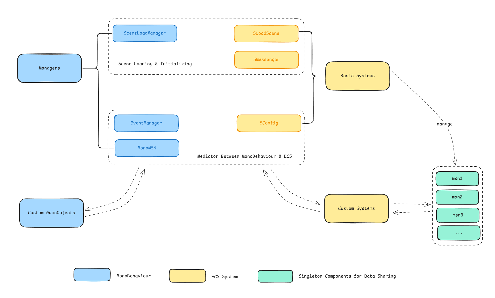

> Grab the code at my repository: https://github.com/zhanong/Minimal-ECS-Framework

The workflow for Unity's Entity Component System (ECS) is still evolving, and there are no established best practices yet.

There are a bunch of ECS tutorials out there to complement the official documentation, but most of them focus on coding details. However, discussions about the bigger picture—how to structure an entire game—are lacking.

So, I want to share my experience with an ECS framework I've developed. This framework was initially created for my construction simulation game.

## Pain Points of ECS

Compared to the MonoBehaviour pattern, ECS has the following pain points:

1. Communication with MonoBehaviours can be very indirect, especially when it's unavoidable.
2. Scene transitions are more complex.
3. Sharing information between systems, especially collections of data, requires a clear strategy.

Systems aren't as flexible as MonoBehaviours for reacting to events, but I wouldn't count this as a con. It's just a matter of changing your coding habits. In return, you get a very tidy, predictable execution process that is easy to scale.

## General Idea



The framework provides minimal, basic MonoBehaviour managers and ECS systems, making it easy to understand and modify.

The framework has the following features:
- It uses the _**Observer Pattern**_ for communication between MonoBehaviours and ECS systems.
- It manages and utilizes a singleton entity **"Messenger"** for passing data between ECS systems.

## Communication Between MonoBehaviour and ECS

Although it's not recommended to interrupt the ECS process with events, the _**Observer Pattern**_ is still valuable for the separation it creates between requesters and responders.

To send data and requests from ECS systems to monobehaviour class is simple. 

Sending data and requests from ECS systems to a MonoBehaviour class is simple. But the other way around is tricky. We need to use a buffer field to store the request, allowing the system to handle it when its update cycle occurs:

```c#
public partial class ExampleSystem : SystemBase
{
	Quest newQuest;

	// Register this to a UnityAction in the EventManager
	void OnQuested(Quest quest)
	{
		newQuest = quest;
	}

	void OnUpdate()
	{
		if (newQuest != Quest.Null)
		{
			// Handle the quest
			newQuest = Quest.Null;
		}
	}
}
```

Additionally, the `MonoMSN` class can serve as a platform where ECS systems and MonoBehaviour classes share useful information.

The `SConfig` system grabs references to all `Blob` data for MonoBehaviour classes to access.

## Organizing the Systems

It's needless to emphasize how important it is to organize the execution order of ECS systems.

Two design patterns are recommended in this framework:
1. ***Factory Pattern***;
2. ***Single-frame Flag Pattern (As I name it)***: System A creates a flag, and System B removes it as soon as it updates. This ensures that systems between A and B will react to this flag only once, and the order of operations is predictable. A and B can be the same system.

This is the execution order I recommand:


> 
> When you make structural changes, some state is only updated at the end of the frame. That's why I put the `Create/Destroy Entities` group at the last step. But for the sake of intuition, let's start with `Handle User Input`.
> 

1. **Handle User Input**: These are systems that handle input from keyboards, UI buttons, etc. Typically, they communicate with UI GameObjects using the _**Observer Pattern**_ mentioned earlier.
2. **Create/Destroy Entities**: This is the "factory" of the ***Factory Pattern***. They recieve request from other systems via the `Messenger` and do the work. Here the `ChangeMSN` acts as the flag for the ***Single-Frame Pattern***. It's turn off at the begining of the step. If any of the following systems makes a change, it's turn on to trigger the systems in `Update On Change` 
3. **Update On Change**: These systems do heavy work, such as rebuilding the pathfinding map or rebuilding the quad tree, so they should only update when there's a relevant change.
4. **Regular Update**: These systems update every frame. For example, the translation system, time system, etc.

Unity recommends organizing systems with `ComponentSystemGroup` and attributes like `[UpdateAfter]`. This can be difficult to visualize and adjust because these attributes are spread across many different files. I suggest creating a single, dedicated file to manage this ordering. For example, in a `SystemGroup.cs` file, systems can be organized like this:

```c#
// Basic systems are organized in another file
// Add this on top to ensure all custom systems update after basic systems
[UpdateAfter(typeof(GBasicSystems))] 

/* UPDATE ON CHANGE */
public partial class GUpdateOnChange : ComponentSystemGroup { }

[UpdateInGroup(typeof(GUpdateOnChange))] public partial class System1 : SystemBase { } [UpdateAfter(typeof(System1))]
	
[UpdateInGroup(typeof(GUpdateOnChange))] public partial struct System2 : ISystem { }[UpdateAfter(typeof(System2))]

[UpdateInGroup(typeof(GUpdateOnChange))] public partial struct System3 : ISystem { }   

[UpdateAfter(typeof(GUpdateOnChange))]
    
/* REGULAR UPDATE */
public partial class GRegularUpdate : ComponentSystemGroup { }

[UpdateInGroup(typeof(GRegularUpdate))] public partial class System4 : SystemBase { } [UpdateAfter(typeof(System4))]
	
[UpdateInGroup(typeof(GRegularUpdate))] public partial struct System5 : ISystem { }

[UpdateAfter(typeof(GRegularUpdate))]

/* HANDLE USER INPUT */
...
```

The trick is to place the `[UpdateAfter]` attribute for the _next_ system or group right after the definition of the _previous_ one in your central file. This way, you can easily reorder systems by moving lines of code—or even entire groups—without having to manually change the class names in the attributes.

## Basic Systems

### Scene Transitions

A common requirement is switching from the main menu to a level or moving from one level to another.

> 
> For clarity, let's define some terms:
> **Scene**: An abstract concept referring to a state of the game (e.g., the main menu, the first level, etc.). 
> **Scene File**: The `.unity` files that you would load and unload when switching scenes if you were in the MonoBehaviour pattern. 
> **Subscene file**: The `.unity` files used for baking GameObjects into entities.
> 

In the MonoBehaviour pattern, you typically put all your GameObjects into Scene Files. So when it comes to switching scenes, it's straightforward: just unload the old one and load the new one.

But with ECS, it's more complicated. For a single "scene," the hierarchy might look like this:

```
scene file
|-- gameObjects(e.g. UI objects)
|-- subscene_file_for_prefabs_and_configurations
|	|--prefabs
|	|--instances_of_prefabs
|	...
|-- subscene_file_for_this_scene
|	|--enemies_etc
|	|--exist_buildings_etc
|	...
```

1. You can destroy Subscenes and load new ones, but you don't want to destroy the one that hosts your prefabs, even though it contains instances that were created for the old scene.
2. Systems can't be "destroyed" in the same way, so you need a mechanism to reset their internal state.

Since the automatic loading and unloading of Scene Files isn't as helpful here, let's discard that approach. Instead, we can make the entire game run within a single Scene File (the default `SampleScene.unity` is sufficient).

When switching "scenes," a 4-step process occurs:
1. Destroy the old GameObjects and instantiate the new ones.
2. Unload the old `subscene_file_for_this_scene` and load the new one.
3. Destroy all entity instances that were part of the old scene but were instantiated from prefabs in a persistent subscene such as the `subscene_file_for_prefabs`
4. Reset all data in the ECS systems and the `Messenger`, applying any configuration from the new scene. 

In my framework, this is handled by:
- `SceneLoadManager` :  A MonoBehaviour class that takes care of step 1.
- `SLoadScene`: A system that takes care of steps 2 and 3.
- `SMessenger`: A system that takes care of step 4.
They all subscribe to a `UnityAction<SceneID>` event, like `questLoadScene`, to trigger the scene-loading process.

For each scene, a ScriptableObject asset specifies the loading information. These assets are loaded by the `SceneLoadManager` at the start of the game:

```c#
public class SceneAsset : ScriptableObject
{
	// an enum representing the scene
	public SceneID sceneID; 
	
	// the "packed" gameObjects for the scene
	public GameObject sceneObject; 
	
	// the reference of the subscene_file_for_this_scene,
	// which you set by dragging the subscene in the inspector
	public EntitySceneReference entitySceneReference; 
}
```

Steps 1 and 2 are easy to understand. **To make step 3 work, you must tag all prefab instances with a `DestroyOnSceneUnload` component at the moment you instantiate them**.

After `SceneLoadManager` and `SLoadScene` finish their work, `SMessenger` begins its update cycle, which I'll cover in the next section.
### Messenger

Frequently, you need to share data among systems. For example:
- Game stats
- Maps
- Requests for other systems

The most staightforward way is to create a singleton entity for each "type" of information, as implemented in the official [*ECSGalaxySample*](https://github.com/Unity-Technologies/ECSGalaxySample/tree/main). However, each singleton occupies a 16KB-sized chunk, and this can add up to a significant memory load. Furthermore, managing multiple singletons during a scene transition is cumbersome. Therefore, I recommend attaching all shared components to a single entity: the `Messenger`.

The `SMessenger` is a system that manage the `Messenger` entity.
1. After switched to a new scene, it reset all components attached to the `Messenger`. 
2. It pauses and resumes custom systems by adding and removing a flag component, like `InitCompleted`, during the scene transition.
3. Additionally, it triggers custom systems to reset their internal fields using the ***Single-frame Flag Pattern*** with the `SystemResetMSN` as a flag.

#### Components Without Native Collections

For components without collections, `SMessenger` provides a convenient way to register your custom component types. You just need to add one line to the `AddOrResetComponents` method. The component will then be added to the `Messenger` and managed by the system.

```c#
void AddOrResetComponents(ref EntityCommandBuffer ecb)
{
	AddOrResetComponent<YourCustomComponent1>(ref ecb, reset_or_add);
	AddOrResetComponent<YourCustomComponent2>(ref ecb, reset_or_add);
}
```

#### Components with Native Collections

However, sometimes you need to use a collection for sharing data, such as a queue of requests for other systems or a 2D map of obstacles. For this, we can consider `DynamicBuffer` or a component with a `NativeCollection`. Most of the time, a `NativeCollection` is more useful due to its flexibility. The main thing we need to worry about is managing their creation and disposal.

Another part of the `SMessenger` system is responsible for managing components that contain `NativeCollection` types. Your custom components need to implement one of these interfaces:
- `ISceneRelatedNativeCollectionComponent` For when the `NativeCollection` needs information from the new scene for initialization (e.g., a 2D map needs to know the world size).
- `IGeneralNativeCollectionComponent` For when the initialization of the `NativeCollection` is not dependent on the scene.
 
Similar to the components without native collections, you just need to add one line in the `BatchProcessCollection` method to register your component.

```c#
void BatchProcessCollection(State state, ref EntityCommandBuffer ecb, in SceneConfig sceneConfig, in SceneID sceneID)
{
	GeneralCollection<YourGeneralComponent>(state, ref ecb);
	SceneRelatedCollection<YourSceneRelatedComponent>(state, ref ecb, in sceneConfig, sceneID);
}
```


## Custom Systems

Use `ISystem` when possible. Use `SystemBase` when the system needs to communicate with MonoBehaviours.
You can use the following template to start building your custom systems (the process for `ISystem` is similar):

```c#
public partial class XXXX : SystemBase
{
	Entity msn;

	protected override void OnCreate()
	{
		// This system will not update until the scene transition is complete
		RequireForUpdate<InitCompleted>();
	}

	protected override void OnUpdate()
	{
		// Get the messenger singleton entity
		if (msn == Entity.Null)
		{
			msn = SystemAPI.GetSingletonEntity<Messenger>();
			return;
		}

		// Check if the system needs to reset its state for a new scene
		if (SystemAPI.IsComponentEnabled<SystemResetMSN>(msn))
		{
			// reset your system if needed 
		}

		// Your main logic goes here
	}
}
```

You can then read from and write to the components on the `msn` entity using `SystemAPI` to share data with other systems.

## To Be Improved

- **Save/Load module**: A save/load system would likely need to be inserted into the scene transition process, executing between the `SLoadScene` and `SMessenger` systems.


